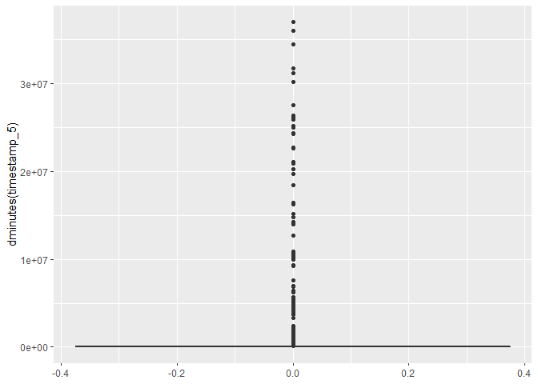

R Markdown
----------

Der Artikel geht folgenden Fragen nach: Ich habe eine Studie in einem
Online-Access Panel (OAP) durchgeführt. - Wie überprüfe ich die
Befragung auf „schlechte“ Befragte und warum sollte ich das tun? - Wer
ist ein „schlechter“ Befragter? - Welche Analysen sollte ich vornehmen?
- Ist es den Aufwand wert?? 1. Motivation Stellen Sie sich vor sie sie
befinden sich an einer Straßenkreuzung in Florenz und fragen einen
Passanten nach dem Weg zum Palazzo Vechio? Wonach beurteilen Sie diesen
Passanten? Sie mustern die Kreuzung nach Personen, die auf den ersten
Blick, - Nicht zu beschäftigt, - Aufgeschlossen und ehrlich, - Und
kompetent erscheinen, in der Hoffnung die richtige Antwort zu erhalten.
Bei einer Befragung gehen Sie nicht anders vor, nur mit dem Unterschied,
dass Sie nicht Ihre 5 Sinne zur Verfügung haben, sondern lediglich die
Daten vor Ihnen. Diese 3 Befragungstypen sollten daher im finalen
Datensatz eliminiert werden, denn: Kein Rat ist besser als schlechter
Rat!

1.  Der Bounty Hunter: Dieser Typ tritt am häufigsten auf. Er hat kein
    grundlegendes Interesse an der Befragung, für Ihn geht es
    ausschließlich um die ausgeschütteten Incentives des Panelbetreiber,
    wie Gutscheine, Schecks etc.. Er versucht aufgrund seines Fokus auf
    das Incentive, die Befragung in der Regel möglichst schnell und mit
    wenig Aufwand abzuschließen, an der Befragung hat er aber kein
    Interesse. Im Grunde handelt er wie ein rationaler Unternehmer,
    manche neigen sogar dazu, zu Täuschen und zu betrügen, um das
    Incentive schneller zu erhalten.
2.  Der Troll: Er möchte die Befragung gezielt manipulieren und
    „Schaden“ anrichten. In der Regel ist nicht erkennbar, warum er die
    Studie torpedieren möchte. Die Motive blieben für den Analysten also
    „irrational“.
3.  Der Überforderte: Diese Person ist von (Teilen) der Befragung
    überfordert und gibt Antworten auf Fragen, die er nicht versteht.
    Ursache ist hierfür der Fragebogen selbst und nicht die Motivation
    des Befragten! Der Fehler ist also bereits beim Studien- und
    Fragebogendesign entstanden!

Abhängig von dem OAP, dem Studien- und Fragebogendesign würde ich die
Quote an nicht erwünschten Panelisten, selbst bei qualitativ
hochwertigen Studien, zwischen 3% und 15% schätzen.

Die Möglichkeiten
-----------------

Zum Bereinigen des Datensatzes wird folgend vorgegangen: 1. Analyse der
Befragungszeit 2. Konsistenzchecks 3. Varianz

Anhand eines typischen Datensatzes werden die Maßnahmen zur Erkennung
„schlechter“ Befragter dargestellt und bewertet.

Zeit ist kostbar – für jeden von uns!
-------------------------------------

Die Analyse der Befragungszeit einer Person ist mit Abstand die
wichtigste Variable. Warum? Insgesamt ist die verbliebene Zeit im
Fragebogen ein Indikator für das Maß an Interesse des Befragten. Vor
allem Der Bounty Hunter hat ein Interesse daran, die Studie möglichst
schnell abzuschließen, um sein Return on Investment (ROI) pro Studie zu
erhöhen. Einige wissen jedoch, dass Sie es nicht übertreiben dürfen und
achten darauf, es mit dem „Durchklicken“ nicht zu übertreiben.  
Fangen wir mit der einfachsten Analyse an:

``` r
library(tidyverse)
library(lubridate)

#Load Data
df <- readRDS("./public_data/survey.rds")
```

Including Plots
---------------

You can also embed plots, for example:

``` r
#Renaming cols
colnames(df) <- gsub("Zeitstempel", "timestamp", colnames(df))

#Transmute timestamps to lubridate duration
df <- df %>%
      select(starts_with("timestamp")) %>%
      transmute_all(duration)


#Create unique ID
df$id <- 1:length(1:nrow(df))
```

``` r
#Plot Boxplot
ggplot(df, aes(y=dminutes(timestamp_5))) + geom_boxplot()
```



Ups! Manchmal hat man eine Visualisierung in Kopf, die am Ende nicht
funktioniert. Setzt man einen Summary Befehl auf sieht man, dass einige
Personen sehr sehr lange für die Befragung gebraucht haben. Man beachte
die große Diskrepanz zwischen Median (`median(df$timestamp_5)`) und
Mittelwert (`mean(df$timestamp_5)`).

``` r
#Plot Boxplot
summary(df$timestamp_5)
```

    ##                       Min.                    1st Qu.                     Median                       Mean 
    ##     "215s (~3.58 minutes)"      "504s (~8.4 minutes)"    "713s (~11.88 minutes)" "5866.2265s (~1.63 hours)" 
    ##                    3rd Qu.                       Max. 
    ##    "1044s (~17.4 minutes)"    "616754s (~1.02 weeks)"

``` r
quantile(df$timestamp_5, seq(0, 1, 0.1))
```

    ##  [1] "215s (~3.58 minutes)"     "380s (~6.33 minutes)"     "465.8s (~7.76 minutes)"  
    ##  [4] "544s (~9.07 minutes)"     "623.6s (~10.39 minutes)"  "713s (~11.88 minutes)"   
    ##  [7] "812s (~13.53 minutes)"    "946s (~15.77 minutes)"    "1200s (~20 minutes)"     
    ## [10] "2116.6s (~35.28 minutes)" "616754s (~1.02 weeks)"

\#Plot ID vs. total\_time ggplot(df, aes(x=id, y=
dminutes(timestamp\_5))) + geom\_point()
